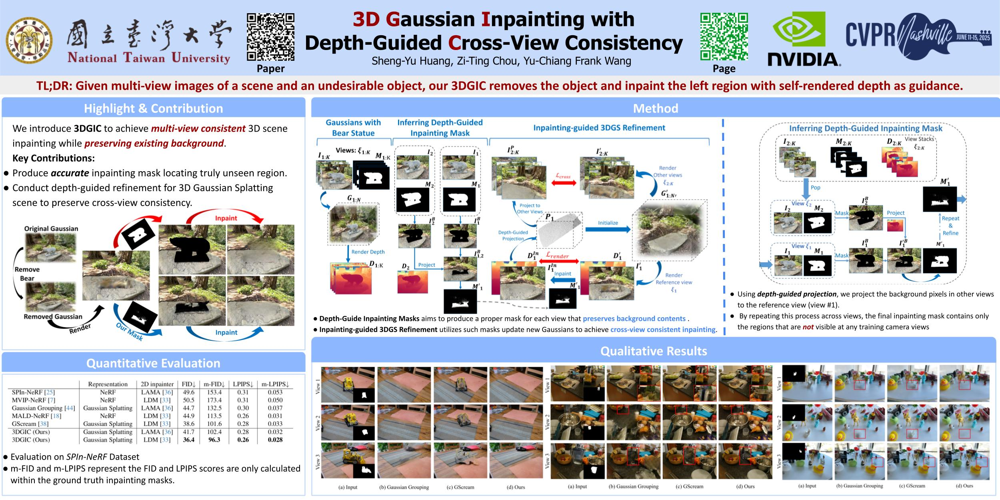

# [CVPR 2025] 3D Gaussian Inpainting with Depth-Guided Cross-view Consistency (3DGIC)<br>
> Sheng-Yu Huang, Zi-Ting Chou, Yu-Chiang Frank Wang <br>
> [Project Page](https://peterjohnsonhuang.github.io/3dgic-pages/) | [Paper](https://arxiv.org/abs/2502.11801)


<div align="center">
  
</div>


#### Install dependencies
for all the packages, please see requirements.txt

#### Install additional pytorch extensions


```shell
# install knn-cuda
pip install ./submodules/simple-knn

# install bvh
pip install ./bvh

# install relightable 3D Gaussian
pip install ./r3dg-rasterization
```

## :bookmark_tabs: Todos
We will be releasing all the following contents:
- [x] Training and inference code for 3DGIC
- [ ] Provide example of the Bear dataset
- [ ] Demo for relighting


### Running
We run the code in a single NVIDIA GeForce RTX 3090 GPU (24G). we will provide almost everything for the bear dataset so you can take a look how to put files. 

If you want to train the 3dgs model from scratch, please run 
:
```
sh script/run_bear.sh
```

for directly inpaint the bear from our provided 3dgs for the bear scene, please run

```
CUDA_LAUNCH_BLOCKING=1 bash ./script/edit_object_inpaint_spin.sh  ./output/NeRF_Syn/bear_0823/3dgs/  ./configs/object_inpaint/bear_new.json
```

## Citing
If you find our work useful, please consider citing:
```BibTeX
@inproceedings{huang20253d,
  title={3d gaussian inpainting with depth-guided cross-view consistency},
  author={Huang, Sheng-Yu and Chou, Zi-Ting and Wang, Yu-Chiang Frank},
  booktitle={Proceedings of the Computer Vision and Pattern Recognition Conference},
  pages={26704--26713},
  year={2025}
}
```

### Acknowledgement

The code base is derived from [GausianGrouping](https://github.com/lkeab/gaussian-grouping) and [Relightable 3D Gaussian](https://github.com/NJU-3DV/Relightable3DGaussian), please consider citing them if using our code.

This project is supported in part by the Tron Future Tech
Inc. and the National Science and Technology Council via grant NSTC 113-2634-F-002-005 and NSTC 113-2640-E-002-003, and the Center of Data Intelligence: Technologies, Applications, and Systems, National Taiwan University (grant nos.114L900902, from the Featured Areas Research Center Program within the framework of the Higher Education Sprout Project by the Ministry of Education (MOE) of Taiwan). We also thank the National Center for High-performance Computing (NCHC) for providing computational and storage resources.


